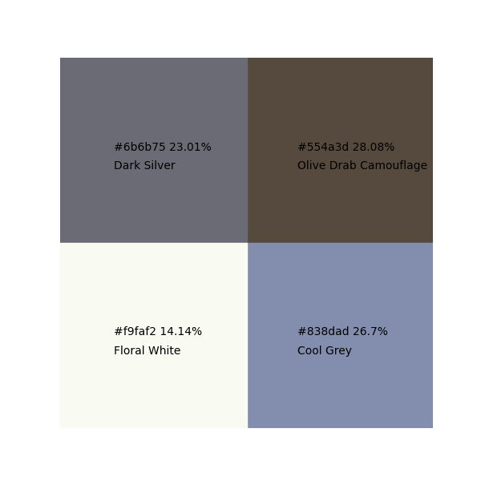
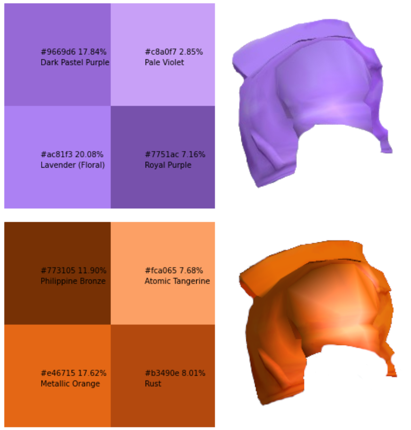

## KMeans Colour Checker
Using KMeans Clustering algorithm we group and look at the percentages and names of colours present in any given image.

### Requirements & Packages
* Python 3.7+ (tested on 3.11)
* Set up venv then: $ pip install -r requirements.txt 
* Photoshop/Gimp (optional to isolate images)

### Example #1: Blue & Black vs White & Gold Dress

### Verdict
Running this picture through the algorithm, we get the top four colours as presented:

Clearly demonstrating not only is the dress not Blue & Black, it is also not Gold & White, but predominately Olive Drab Camoflage & Cool Grey.

### Example #2: SSBM Fox Jacket Colours
Colloquially referred to as Blue and Red within the SSBM community, we run an analysis on both jackets:

### Verdict
Running this picture through the algorithm, and doing some Photoshop to combine the results, we see:

Proving definitively the colours are Purple/Lavender and Orange.
